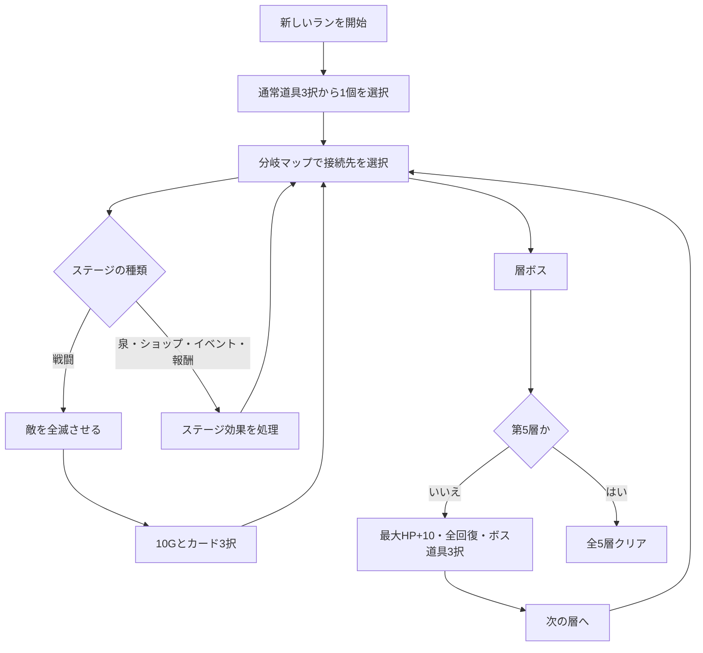

# Lost Page ゲーム企画・現行仕様書

## 文書情報

| 項目 | 内容 |
| --- | --- |
| タイトル | Lost Page |
| ジャンル | ターン制デッキ構築ローグライト |
| 対応環境 | Windows 64-bit / Android 8.0以上（ARM64） |
| 対象バージョン | v1.1.1 |
| 企画・ゲームデザイン | Rain |
| 設計具体化・Unity実装・検証 | Codex（OpenAI） |
| 文書の位置づけ | 初期企画と追加要件を、現在の実装に合わせて統合した仕様書 |

本書では、実装済みの挙動を「現行仕様」として記載する。将来実装する内容は「未実装・今後の候補」で区別する。

## 1. 企画概要

Lost Pageは、カードと4種類のエーテルを組み合わせて戦い、分岐マップを攻略するターン制カードバトルゲームである。

プレイヤーは毎ターン、エーテルプールからランダムにエーテルを取得する。カードを使うには、指定された色と個数のエーテルを支払う必要がある。

戦闘で使うエーテルの構成は、現在のデッキに入っている全カードのコスト合計から作られる。そのため、カード取得は単純な選択肢の追加ではなく、各色の出現確率とプールが一巡するまでの長さも変化させる。

プレイヤーは、現在の行動へエーテルを使うか、次のターンへ持ち越して強いカードを狙うかを判断する。戦闘外では左右のルートを選び、報酬と危険を比較しながら全5層の最深部を目指す。

### 1.1 企画上の柱

1. デッキ構築とリソース出現率が連動する。
2. ランダム取得の中にも、持ち越しと使用順による計画性がある。
3. カードを増やすことに利点と不利点の両方がある。
4. マップ上のルート選択で、戦闘・回復・買い物・報酬の優先順位を選べる。
5. PCではマウス、Androidではタッチによる同じ操作感を目指す。

### 1.2 現在の物語設定

ストーリーは未設定である。現段階では、ゲームシステムとプレイ感の検証を優先する。

## 2. ラン全体の流れ

訪れたマスへ戻ることができる。初回訪問時にだけイベントが発生し、再訪時は原則として何も起こらない。ただし、ショップは再訪して何度でも利用できる。

すべてのマスを訪れる必要はない。接続されたルートを選び、ボスを倒せば次の層へ進める。

## 3. 初期状態

| 項目 | 初期値 |
| --- | ---: |
| 最大HP | 100 |
| 現在HP | 100 |
| シールド | 0 |
| ゴールド | 0G |
| エーテル取得数 | 毎ターン5個 |
| エーテル持ち越し上限 | 2個 |
| デッキ上限 | なし |

### 3.1 初期デッキ

| カード | 枚数 | 1枚のコスト |
| --- | ---: | --- |
| 攻撃カード | 3 | 赤2 |
| 防御カード | 3 | 赤1・青1 |
| チャージカード | 1 | 黄2 |
| 合計 | 7 | 赤9・青3・黄2 |

初期デッキには紫エーテルを要求するカードがないため、初期エーテルプールに紫は含まれない。

### 3.2 開始時の道具

ラン開始時、所持可能な通常道具からランダムに3個を提示し、1個を選択する。道具を選ばずに開始することはできない。

## 4. エーテルシステム

### 4.1 種類と表示

| 種類 | 色 | アイコン |
| --- | --- | --- |
| 赤エーテル | 赤 | 三角形 |
| 青エーテル | 青 | 六角形 |
| 黄エーテル | 黄 | 四角形 |
| 紫エーテル | 紫 | ひし形 |

各色の所持数に個別上限はない。

### 4.2 3つの領域

| 領域 | 役割 | 戦闘画面 |
| --- | --- | --- |
| 未使用エーテル | 今後取得できるエーテル | 左側 |
| 手番エーテル | 現在のターンに支払いへ使えるエーテル | 下部 |
| 使用済みエーテル | カードで消費した、または持ち越さなかったエーテル | 右側 |

カードの支払いに使ったエーテルは、手番から使用済みへ移動する。

### 4.3 プールの生成

戦闘開始時、デッキ内の全カードについてコストを色別に合計し、その個数を未使用エーテルへ入れる。

例として、赤2のカードを3枚、赤1・青1のカードを3枚、黄2のカードを1枚所持している場合、赤9・青3・黄2の合計14個でプールを開始する。

同じカードを複数枚持っている場合、それぞれのコストを加算する。デッキ枚数に上限はないため、カードを増やすほどエーテル総数も増える。

### 4.4 ターン開始時の取得

プレイヤーターン開始時、未使用エーテルからランダムに5個取得して手番へ移す。エネルギーコアを所持している場合は6個取得する。

取得途中で未使用が空になった場合、使用済みを未使用へ戻して不足分の取得を続ける。使用済みにもエーテルがなければ、取得可能な個数で終了する。

前ターンから持ち越したエーテルは手番に残っているため、新しく取得した分へ加算される。

### 4.5 支払い

カードに設定された全色の必要数を手番に所持し、クールタイムなどの使用条件も満たす場合だけ使用できる。

使用できないカードは一覧に残し、グレーアウトする。持続カードは、そのカードを戦闘中に一度発動すると一覧から非表示になる。

### 4.6 ターン終了と持ち越し

エーテルがなくなった場合や、使用可能なカードがなくなった場合でも、ターンは自動終了しない。プレイヤーが「ターン終了」を押すまで状態を確認できる。

通常は、残った手番エーテルから最大2個を次のターンへ持ち越す。鞄系道具で上限を増やせる。

- 残数が上限以下：残っているエーテルをすべて自動で持ち越す。
- 残数が上限より多い：上限と同じ個数をプレイヤーが選ぶ。
- 持ち越し選択中：キャンセルして戦闘画面へ戻れる。
- 選ばなかった分：使用済みエーテルへ移動する。

## 5. カード管理

### 5.1 表示

戦闘中は所持カードを常に一覧表示し、横スクロールできる。同名カードも1枚ずつ別のカードとして表示する。

カードを選ぶと画面中央に次を表示する。

- カード名
- 消費エーテルの色・形・個数
- 現在の効果量
- クールタイム
- 使用可能または使用不可の理由
- 選択中の敵へ使用、敵全体へ使用、カードを使用の各ボタン

### 5.2 ソート

カード取得時、次の分類順で自動ソートする。

1. 攻撃
2. 防御
3. チャージ
4. 持続

同じ分類の中では取得順を維持する。

### 5.3 クールタイム

カードを使うと、そのカード個体の残りクールタイムを規定値へ設定する。各プレイヤーターン開始時に1減少し、0になると再使用できる。

同名カードを複数所持していても、クールタイムは各カードで独立する。

持続カードはクールタイムを持たず、各カードにつき1戦闘1回だけ発動できる。発動状態とクールタイムは戦闘ごとにリセットする。

## 6. 戦闘ルール

### 6.1 プレイヤーターン

1. 使用カードのクールタイムを1減らす。
2. 防御維持、シールド貯蔵庫、通常消失の順でシールドを処理する。
3. 自動防御があればシールドを得て、自動防御を1減らす。
4. チャージを保持していなければ星系道具のチャージを得る。
5. 新しいエーテルを取得する。
6. プレイヤーが任意の順でカードを使用する。
7. プレイヤーが「ターン終了」を押し、必要なら持ち越しを選択する。

1ターンに使用できるカード枚数の上限はない。コスト、クールタイム、戦闘中1回制限を満たす限り連続使用できる。

### 6.2 敵ターン

生存している敵が順番に行動する。敵は自分の行動直前に残っているシールドを0にし、決められた行動パターンに従って攻撃、防御、弱体のいずれかを実行する。

### 6.3 シールド

受けたダメージはシールドから先に減少し、残りがHPへ入る。貫通攻撃はシールドを減らさずHPへ直接ダメージを与える。

プレイヤーのシールドは、次の自分のターン開始時に原則として0になる。防御維持がある場合は全量を保持し、シールド貯蔵庫がある場合は半分を残す。

### 6.4 勝利と敗北

- 勝利：出現した敵をすべて倒す。
- 敗北：プレイヤーHPが0になる。
- ボス勝利：現在の層をクリアする。
- 最終勝利：第5層のボスを倒す。

## 7. 戦闘画面と操作

### 7.1 レイアウト

| 位置 | 内容 |
| --- | --- |
| 上部 | 敵、敵HPゲージ、シールド、次の行動 |
| 中部 | 選択カードの詳細とコストアイコン |
| 中下部 | 横スクロール可能なカード一覧 |
| 左側 | 未使用エーテル |
| 右側 | 使用済みエーテル |
| 下部 | HP、シールド、手番エーテル、バフ・デバフ、道具、ターン終了 |

### 7.2 カード操作

- カードをタップまたはクリック：詳細を表示する。
- 攻撃カードを敵へドラッグ：その敵を対象に使用する。
- 防御・チャージ・持続カードを中央のカード詳細欄へドラッグ：自分へ使用する。
- 使用ボタン：ドラッグを使わず、選択中のカードを使用する。
- カード列と同じY位置で左右へ動かす：カード一覧をスクロールする。
- カード列より上へ動かす：カードドラッグへ切り替える。

全体攻撃も敵へドロップできるが、効果は全生存敵へ適用する。

## 8. カード一覧

効果量は、攻撃力、防御力、チャージ、弱体、道具などで変動する場合がある。表は基本値を示す。

### 8.1 攻撃カード

| カード | コスト | 基本効果 | CT |
| --- | --- | --- | ---: |
| 攻撃カード | 赤2 | 敵単体に5ダメージ | 1 |
| 強撃 | 赤2・青1 | 敵単体に17ダメージ | 2 |
| 薙ぎ払い | 赤3 | 敵全体に9ダメージ | 2 |
| 成長撃 | 赤3 | 敵単体に8ダメージ。使用後、このカード個体の基礎ダメージ+3 | 2 |
| 乱撃 | 赤4 | 生存敵からランダムに選び、10ダメージの攻撃を4回 | 4 |
| 紅脈撃 | 赤3・青2 | 敵単体に「全領域の赤エーテル総数+10」ダメージ | 4 |
| 破界撃 | 赤5 | 敵全体に36の固有貫通ダメージ | 4 |

成長撃の成長量は使用するたび累積し、8、11、14、17……と増える。別の成長撃カードとは共有しない。成長量は戦闘終了時にリセットする。

紅脈撃が参照する赤エーテルは、未使用・手番・使用済みの合計である。支払いによって領域が移動しても総数は変わらない。

乱撃は1回ごとに攻撃対象を抽選する。同じ敵へ複数回当たる場合があり、途中で敵を倒した場合は残りの攻撃を生存敵から抽選する。

### 8.2 防御カード

| カード | コスト | 基本効果 | CT |
| --- | --- | --- | ---: |
| 防御カード | 赤1・青1 | 自分に7シールド | 1 |
| 堅守 | 青2 | 自分に12シールド | 2 |
| 自動障壁 | 青2 | 自動防御を3獲得 | 2 |
| 守勢継続 | 青3 | 自動防御と防御維持を2ずつ獲得 | 3 |
| 鏡盾 | 青4 | 現在のシールドを2倍にし、防御維持を2獲得 | 4 |

鏡盾は現在のシールドと同量を追加する処理であり、カード効果に防御力を加算しない。

### 8.3 チャージカード

| カード | コスト | 基本効果 | CT |
| --- | --- | --- | ---: |
| チャージカード | 黄2 | チャージを3獲得 | 2 |
| 共鳴 | 赤2・黄1 | 全領域の赤エーテル総数と同じチャージを獲得 | 3 |
| 治癒 | 黄3 | HPを6回復。最大HPは超えない | 2 |
| 転換 | 黄3 | 支払い後の手番エーテルをランダムな1色へすべて変換し、その色を2個追加 | 3 |

チャージは次に使用する攻撃または防御系カードの効果量へ加算し、そのカードの処理後に消える。複数回得た場合は加算する。

### 8.4 持続カード

| カード | コスト | 効果 | 使用制限 |
| --- | --- | --- | --- |
| 持続カード | 赤1・紫1 | 発動後、攻撃カードを3枚使うごとに戦闘中の攻撃力+1 | 1戦闘1回 |
| 守護循環 | 青1・紫2 | 発動後、カードを3枚使うごとに自動防御+2 | 1戦闘1回 |

同じ持続効果を複数枚発動した場合は層として重なる。持続カードは3回ごとの攻撃力上昇量が層数分になり、守護循環は3枚ごとの自動防御獲得量が「2×層数」になる。

守護循環を発動したカード自身は、発動前に存在していた守護循環のカウント対象になる。新しく増えた層は、その次に使用するカードからカウントへ参加する。

## 9. バフ・デバフ

| 状態 | 現行仕様 |
| --- | --- |
| チャージ | 次の攻撃・防御系カードへ数値を加算し、処理後に消える |
| 弱体 | 次の攻撃・防御系カードの効果量を数値分減らし、処理後に消える。敵の弱体1回につき+3 |
| 攻撃力 | 戦闘中、攻撃カードのダメージへ加算。ターン経過や攻撃で減らず、戦闘終了時にリセット |
| 防御力 | 防御カードのシールド量と、自動防御発動時のシールド量へ加算。戦闘終了時にリセット |
| 貫通 | 攻撃1回につき1消費し、その攻撃をシールド無視にする。敵シールドは減らない |
| 防御維持 | 自分のターン開始時に1消費し、現在のシールドを全量保持 |
| 自動防御 | 自分のターン開始時、現在層+防御力のシールドを得た後に1減少 |
| 持続攻撃 | 攻撃カード3枚ごとに、持続層数だけ攻撃力を増加 |
| 守護循環 | カード3枚ごとに、守護循環層数×2の自動防御を獲得 |

乱撃は4回の各ヒットを個別の攻撃として貫通を判定する。通常の単体攻撃や全体攻撃は、カード1枚の攻撃として貫通を1消費する。破界撃の固有貫通は貫通の残数を消費しない。

戦闘画面下部に状態を表示する。状態アイコンをタップして詳細を開く機能は未実装である。

## 10. 敵

### 10.1 行動

| 行動 | 効果 |
| --- | --- |
| 攻撃 | プレイヤーへ固定値のダメージ |
| 防御 | 敵自身へ固定値のシールド |
| 弱体 | プレイヤーの次の攻撃・防御系カードを3弱体化 |

各敵は固定の行動パターンを繰り返し、次の行動を画面に表示する。

### 10.2 通常敵

| 編成 | 基準HP | 攻撃 | 防御 | 行動パターン |
| --- | --- | ---: | ---: | --- |
| 紙喰らい | 30 | 7 | 6 | 攻撃→防御→弱体 |
| 墨の影A | 30 | 6 | 5 | 攻撃→弱体→防御 |
| 墨の影B | 30 | 6 | 5 | 防御→攻撃→弱体 |
| 失稿の番人 | 50 | 9 | 8 | 弱体→攻撃→防御→攻撃 |
| 綴じ糸の獣 | 45 | 8 | 7 | 攻撃→攻撃→防御 |
| 破れた騎士 | 55 | 9 | 8 | 防御→弱体→攻撃 |

マップ内の戦闘ステージ順に4種類の編成を繰り返す。2体編成は、墨の影A+B、または綴じ糸の獣+破れた騎士である。

### 10.3 ボス

| 名前 | 基準HP | 攻撃 | 防御 | 行動パターン |
| --- | ---: | ---: | ---: | --- |
| ロストページの主 | 80 | 12 | 10 | 攻撃→防御→弱体→攻撃 |

戦闘中の内部名称は「ロストページの主」だが、勝利画面では「○層をクリアした」と表示する。

## 11. マップ

### 11.1 構成

各層は開始地点、左右2列の中間ステージ、ボスで構成する。各行から次の行の左右どちらにも進め、前の行へ戻ることもできる。

| 層 | 中間行 | 中間マス | 開始・ボス込み |
| ---: | ---: | ---: | ---: |
| 1 | 4 | 8 | 10 |
| 2 | 5 | 10 | 12 |
| 3 | 6 | 12 | 14 |
| 4 | 7 | 14 | 16 |
| 5 | 8 | 16 | 18 |

各層には回復の泉、ショップ、何もない場所、報酬の間を1マスずつ配置し、残りを通常戦闘にする。

### 11.2 マスの再訪

- 未訪問：マス固有の処理を実行する。
- 訪問済み戦闘、泉、イベント、報酬、開始地点：何も起こらない。
- 訪問済みショップ：再びショップを開ける。
- マップ表示：上下左右へ自由にスクロールできる。

## 12. ステージ・報酬・経済

### 12.1 通常戦闘

勝利すると10Gを獲得し、全18種からランダムに選ばれた異なるカード3枚のうち1枚を取得する。

不思議なプレゼントボックスを所持している場合、通常の3択取得後に新しい3択をもう一度行い、合計2枚取得する。

### 12.2 回復の泉

初回訪問時にHPを30回復する。最大HPを超えて回復しない。再訪時は効果がない。

### 12.3 ショップ

- カード価格：全種類一律20G
- 商品：実装済み全18種
- 購入回数：所持ゴールドがある限り制限なし
- 再入場：可能
- デッキ上限：なし

### 12.4 何もない場所

初回訪問時、次の3種類から同確率で1つが発生する。

| イベント | 結果 |
| --- | --- |
| 落とし物 | 15G獲得 |
| 休息場所 | HPを20回復 |
| 罠と報酬 | HPを10失い、25G獲得 |

罠でHPが0になった場合は敗北する。

### 12.5 報酬の間

初回訪問時、ランダムな異なるカード2枚を自動取得する。

さらに、獲得可能なレア道具が残っている場合は30%の確率で、その中からランダムに1個を獲得する。

### 12.6 ボス

ボスを倒すたびに、最大HPを10増加して最大まで回復する。

第1～第4層では、獲得可能なボス道具からランダムに最大3個を提示し、1個を選択する。その後、次の層へ進む。

第5層では道具報酬を出さず、そのまま全層クリアとする。

## 13. 持ち込み道具一覧

### 13.1 通常道具

ラン開始時に3択から1個を選ぶ。各道具の所持上限は1個。

| 道具 | 効果 |
| --- | --- |
| 刃の欠片 | 攻撃カードのダメージが常時+1 |
| 守護の札 | 防御カードと堅守で得るシールドが+2 |
| 貫通の針 | 各戦闘で最初に使う攻撃カードが敵シールドを無視 |
| 小さな鞄 | 持ち越せるエーテル数+1 |
| エーテル赤結晶 | 赤3個以上のカード使用後、戦闘中の攻撃力+1 |
| エーテル青結晶 | 青3個以上のカード使用後、戦闘中の防御力+1 |
| 星の欠片 | ターン開始時にチャージがなければチャージ+6 |

### 13.2 レア道具

報酬の間で30%の確率で獲得する。各道具の所持上限は1個。

| 道具 | 効果 |
| --- | --- |
| 星の塊 | ターン開始時にチャージがなければチャージ+10 |
| シールド貯蔵庫 | 防御維持がないターン開始時、シールドを半分残す |
| ヴォーパルハート | 攻撃・防御系カードでチャージを使用した後、チャージの半分を残す |
| 不思議なプレゼントボックス | 通常戦闘のカード報酬3択を追加でもう1回行う |

星の欠片、星の塊、星の宝玉を同時に持つ場合は、星の宝玉、星の塊、星の欠片の優先順で1種類だけ発動する。

### 13.3 ボス道具

第1～第4層のボス撃破時に3択から1個を選ぶ。

| 道具 | 効果 | 所持上限 |
| --- | --- | ---: |
| 大きな鞄 | 持ち越せるエーテル数+2 | 2 |
| 星の宝玉 | ターン開始時にチャージがなければチャージ+18 | 1 |
| エネルギーコア | 毎ターン取得するエーテル数+1 | 1 |
| 大型ベルト | 戦闘開始時、所持する持続カード1枚をランダムに選び、コストなしで発動 | 1 |
| 守護者の裁き | シールド獲得時、その時点のシールド総量の20%をランダムな生存敵へ与える | 1 |
| ヴォーパルダガー | 単体攻撃カードでは、戦闘中の攻撃力をカードの総エーテルコスト倍で適用 | 1 |

大きな鞄は2回まで候補に出現し、それ以外の道具は一度獲得すると再び候補に出ない。

大型ベルトで発動可能な持続カードがない場合、効果は発動しない。

## 14. 階層進行と難易度

### 14.1 敵HP

基準HPに対し、層ごとに次の倍率を適用する。端数は切り上げる。

| 層 | HP倍率 |
| ---: | ---: |
| 1 | 100% |
| 2 | 120% |
| 3 | 140% |
| 4 | 160% |
| 5 | 180% |

### 14.2 敵攻撃力

攻撃力の増加はHPより緩やかにする。

| 層 | 基準値への加算 |
| ---: | ---: |
| 1 | +0 |
| 2 | +0 |
| 3 | +1 |
| 4 | +1 |
| 5 | +2 |

敵の防御力と行動パターンは層によって変化しない。

### 14.3 プレイヤー成長

- ボス撃破ごとに最大HP+10
- ボス撃破ごとにHPを最大まで回復
- カードは戦闘、報酬の間、ショップで追加
- 道具は開始時、報酬の間、ボス報酬で追加
- ゴールド、カード、道具、現在HP、最大HPは層をまたいで保持
- 戦闘中のシールド、攻撃力、防御力、貫通、持続状態、カード成長、クールタイムは戦闘ごとにリセット

## 15. チュートリアル

### 15.1 初回操作ガイド

各ランの最初の戦闘で一度だけ表示し、次を実操作で案内する。

1. 攻撃カードを敵へドラッグ、または使用ボタンで発動
2. 「ターン終了」を押す
3. 持ち越すエーテルを選ぶ
4. チャージカードを中央の詳細欄へドラッグ

チュートリアル中も通常操作を妨げず、途中でスキップできる。必要なカードコストが手番に揃っていない場合は、手番総数を変えずに色を交換して進行可能にする。

### 15.2 遊び方ブック

マップと戦闘画面から、いつでも5ページの画像説明を開ける。

| ページ | 内容 |
| ---: | --- |
| 1 | 戦闘画面とエーテル |
| 2 | 攻撃と敵の選択 |
| 3 | 自分に使うカード |
| 4 | ターン終了と持ち越し |
| 5 | マップとデッキ強化 |

前後ボタンと横スワイプに対応する。

## 16. UI表示方針

- 使用可能カードはカテゴリ色で表示する。
- 使用不可カードはグレー表示する。
- 選択中カードはアクセント色を混ぜて強調する。
- カード詳細にはエーテルコストをテキストだけでなくアイコンでも表示する。
- 敵ごとにHP、シールド、次の行動を表示する。
- プレイヤーのHPとシールドを画面下部へ表示する。
- 未使用エーテルは左、使用済みエーテルは右、手番エーテルは下部へ表示する。
- 所持道具はマップと戦闘画面から一覧表示できる。
- ボス勝利時は「ロストページの主を倒した」ではなく「○層をクリアした」と表示する。

## 17. 実装構成

| 領域 | 実装 |
| --- | --- |
| エンジン | Unity 6000.3.12f1 |
| UI | Unity uGUI 2.0.0 |
| 言語 | C# |
| Android | IL2CPP、ARM64、最小API 26 |
| Windows | StandaloneWindows64 |
| シーン | `Assets/LostPage/Scenes/Main.unity` |
| モデル | `Assets/LostPage/Scripts/Model` |
| UI | `Assets/LostPage/Scripts/UI` |
| 検証・ビルド | `Assets/LostPage/Editor/LostPageProjectTools.cs` |

ゲーム画面はuGUIを使ってコードから構築する。エーテル画像とチュートリアル画像はシーン内の参照オブジェクトを通じて読み込む。

## 18. 検証方針

エディタメニュー`Lost Page > Validate Model`で、次を含むモデル仕様を検証する。

- 初期HP、ゴールド、デッキ
- エーテルプール構成と循環
- カードコスト、効果、クールタイム
- 取得カードの分類別ソート
- 持ち越しと鞄の上限
- 攻撃、防御、チャージ、弱体、貫通、持続効果
- 追加カードと成長撃の累積
- 道具効果、レアリティ、所持上限
- 通常報酬、ショップ、イベント、報酬の間、ボス報酬
- 全5層のマップ数、HP倍率、攻撃力倍率、層クリア回復

Windows版は実行ファイルの起動、Android版はAPK構成・署名・API・ARM64を確認する。

## 19. 未実装・今後の候補

### 19.1 セーブ

現時点ではセーブ機能がない。将来は戦闘中の状態を含め、次を保存対象とする想定である。

- 現在の層とマップ位置
- 訪問・クリア済みマス
- HP、最大HP、ゴールド
- デッキ、カード個体、所持道具
- 戦闘中の敵、ターン、エーテル3領域、状態、クールタイム

保存形式や再開タイミングは未決定である。

### 19.2 状態詳細

戦闘画面にはバフ・デバフ状態を表示しているが、アイコンをタップして詳細説明を開く機能は未実装である。

### 19.3 演出

ストーリー、キャラクター演出、カードアニメーション、音楽、効果音は未実装である。

### 19.4 配布

v1.1.1のAndroid APKはGitHubからの直接配布用で、デバッグ証明書を使用している。Google Playへ公開する場合は、正式なキーストア、ストア向け識別情報、AAB、ストア素材を別途用意する。

## 20. 制作体制

### Rain

原案、ゲームシステム構想、カード・道具・マップ・報酬・UI要件、バランス数値、対応環境、追加仕様、テスト時のフィードバック、最終的な仕様判断を担当する。

### Codex（OpenAI）

企画の構造化、仕様間の整合、推奨仕様の提示、Unity/C#実装、UIと操作、画像組み込み、モデル検証、Android実機調査、Windows/Androidビルド、GitHubリポジトリとRelease、公開文書の整備を担当する。

詳細な作業分担は[READMEの担当・クレジット](./README.md#担当クレジット)を参照する。
