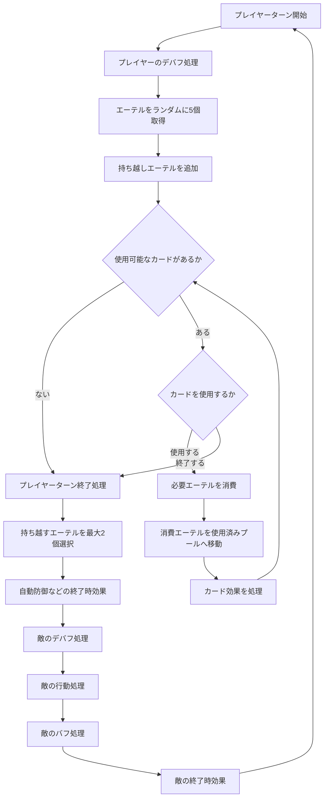

# ロストページライクゲーム

## バトルシステム企画概要

## 1. ゲーム概要

本作は、カードと4種類の「エーテル」を組み合わせて戦う、ターン制のカードバトルゲームである。

プレイヤーは毎ターン、エーテルプールからランダムにエーテルを取得し、所持しているエーテルを消費してカードを使用する。

カードの構成によってバトル中に登場するエーテルの種類と総数が変化するため、デッキ構築そのものがエーテルの出現確率や行動の安定性に影響する。

限られたエーテルをどのカードに使用するか、未使用のエーテルを次のターンへ持ち越すかを判断することが、戦闘における中心的な駆け引きとなる。

---

## 2. エーテルシステム

### 2.1 エーテルの種類

エーテルは以下の4種類が存在する。

| 種類    | 表示色 |
| ----- | --- |
| 赤エーテル | 赤   |
| 青エーテル | 青   |
| 黄エーテル | 黄   |
| 紫エーテル | 紫   |

各種類のエーテルについて、プレイヤーが一度に所持できる数に上限は存在しない。

---

### 2.2 エーテルの用途

カードを使用する際には、そのカードに設定された種類と個数のエーテルを消費する。

例：

| カード     | 必要エーテル |
| ------- | ------ |
| 攻撃カード   | 赤2     |
| 防御カード   | 赤1・青1  |
| チャージカード | 黄2     |
| 持続カード   | 赤1・紫1  |

必要なエーテルをすべて所持しており、カード固有の使用条件も満たしている場合、そのカードを使用できる。

---

### 2.3 エーテルプール

エーテルは、以下の3つの領域で管理される。

| 領域          | 役割                      |
| ----------- | ----------------------- |
| 未使用エーテルプール  | まだ取得されていないエーテルを保管する     |
| 手番エーテルプール   | 現在のターンで使用可能なエーテルを保管する   |
| 使用済みエーテルプール | カード使用によって消費されたエーテルを保管する |

プレイヤーのターン開始時に、未使用エーテルプールからランダムに5個のエーテルを取得し、手番エーテルプールへ移動する。

カードを使用した場合、支払ったエーテルは手番エーテルプールから使用済みエーテルプールへ移動する。

未使用エーテルプールが空になった場合、使用済みエーテルプール内のエーテルをすべて未使用エーテルプールへ戻し、再び取得可能な状態にする。

---

## 3. デッキとエーテル構成

### 3.1 エーテル総数の決定方法

バトルで使用されるエーテルの種類と総数は、デッキ内のカードが要求するエーテルの合計によって決定される。

つまり、各カードを確実に1回使用できるだけのエーテルが、バトル開始時のエーテルプールに用意される。

これにより、特定の色を多く要求するカードをデッキへ入れるほど、その色のエーテルが取得されやすくなる。

---

### 3.2 構成例1

デッキ構成：

* 攻撃カード × 2
* 防御カード × 2
* チャージカード × 1

カードごとの必要エーテル：

| カード     | 枚数 | 1枚あたりの必要エーテル | 合計    |
| ------- | -: | ------------ | ----- |
| 攻撃カード   |  2 | 赤2           | 赤4    |
| 防御カード   |  2 | 赤1・青1        | 赤2・青2 |
| チャージカード |  1 | 黄2           | 黄2    |

エーテルプールの合計：

| 種類 | 個数 |
| -- | -: |
| 赤  |  6 |
| 青  |  2 |
| 黄  |  2 |
| 紫  |  0 |
| 合計 | 10 |

---

### 3.3 構成例2

デッキ構成：

* 攻撃カード × 1
* 防御カード × 3
* 持続カード × 1

カードごとの必要エーテル：

| カード   | 枚数 | 1枚あたりの必要エーテル | 合計    |
| ----- | -: | ------------ | ----- |
| 攻撃カード |  1 | 赤2           | 赤2    |
| 防御カード |  3 | 赤1・青1        | 赤3・青3 |
| 持続カード |  1 | 赤1・紫1        | 赤1・紫1 |

エーテルプールの合計：

| 種類 | 個数 |
| -- | -: |
| 赤  |  6 |
| 青  |  3 |
| 黄  |  0 |
| 紫  |  1 |
| 合計 | 10 |

---

## 4. カード使用ルール

プレイヤーのターン中は、以下の条件を満たしているカードを任意の順番で使用できる。

### 使用条件

* カードに必要な種類と数のエーテルを所持している
* カード固有の使用条件を満たしている
* カードが使用禁止状態になっていない

1ターン中に使用できるカードの枚数に上限はない。

必要なエーテルが残っている限り、プレイヤーは複数のカードを連続して使用できる。

カードの使用順によって、バフ、デバフ、エーテルの変換、追加取得などの結果が変化することを想定する。

---

## 5. ターン終了

プレイヤーのターンは、以下のいずれかの条件で終了する。

### 自動終了

使用可能なカードが1枚も存在しない場合、プレイヤーのターンを終了する。

### 任意終了

使用可能なカードが残っている場合でも、プレイヤーがターン終了を選択することで終了できる。

---

## 6. エーテルの持ち越し

ターン終了時に手番エーテルプールへ未使用のエーテルが残っていた場合、最大2個まで次のターンへ持ち越せる。

### 残存数が2個以下の場合

残っているエーテルをすべて次のターンへ持ち越す。

### 残存数が3個以上の場合

プレイヤーが、持ち越すエーテルを2個選択する。

選択されなかったエーテルは手番エーテルプールから除外され、規定のエーテルプールへ戻される。

持ち越したエーテルは、次のターンに新たに取得するエーテルへ追加される。

例：

前のターンから赤1、青1を持ち越した状態で、新たに5個取得した場合、次のターンは合計7個のエーテルから行動を開始する。

---

## 7. コアゲームループ

### プレイヤーターン開始

1. プレイヤーに付与されているターン開始時デバフを処理する
2. 未使用エーテルプールからエーテルをランダムに5個取得する
3. 前ターンから持ち越したエーテルがある場合、取得したエーテルへ追加する

### プレイヤー行動

4. プレイヤーが使用するカードを選択する
5. カードに必要なエーテルを手番エーテルプールから支払う
6. 支払ったエーテルを使用済みエーテルプールへ移動する
7. カードの効果を発動し、処理する
8. プレイヤーが行動を継続する場合は手順4へ戻る

### プレイヤーターン終了

9. プレイヤーがターン終了を宣言する、または使用可能なカードがなくなる
10. 未使用エーテルが残っている場合、最大2個まで持ち越すエーテルを決定する
11. プレイヤーのターン終了時効果を処理する
12. 自動防御など、ターン終了時に発動する効果を処理する

### 敵ターン

13. 敵に付与されているターン開始時デバフを処理する
14. 敵の行動を決定する
15. 敵の攻撃やスキルを発動し、処理する
16. 敵のバフを処理する
17. 敵のターン終了時効果を処理する
18. 自動防御など、敵側の一部効果を処理する

その後、再びプレイヤーターン開始時の処理へ戻る。

---

## 8. バトルフロー

---

## 9. 本システムの特徴

### デッキ構築とリソース構成の連動

カードの要求エーテルが、そのままエーテルプールの構成へ反映される。

強力なカードを多く入れるだけではなく、どの色のエーテルがどの程度の確率で取得できるかまで考えてデッキを構築する必要がある。

### ランダム性と計画性の両立

毎ターン取得するエーテルはランダムだが、エーテルプールの中身自体はプレイヤーのデッキ構築によって決まる。

そのため、完全な運任せではなく、デッキ構築によってランダム性を制御できる。

### 持ち越しによる選択

未使用エーテルを最大2個まで持ち越せるため、そのターンでカードを使用するか、次のターンのためにエーテルを保存するかという判断が発生する。

### カードの連続使用

1ターン中のカード使用枚数に上限がないため、エーテルの組み合わせ次第では複数カードを連続して使用できる。

カード同士の相乗効果や使用順を考えることが、戦闘の重要な要素となる。

---

## 10. 想定されるプレイヤーの判断

プレイヤーは毎ターン、主に以下の判断を行う。

* 現在使用可能なカードの中から、どのカードを優先するか
* エーテルをすべて使用するか
* 次のターンへ持ち越すエーテルを確保するか
* 複数カードを連続使用するか
* 防御を優先するか、攻撃を優先するか
* エーテルプールの残りを考慮して行動するか
* 次に取得されやすいエーテルを予測するか

---

## 11. 要確認事項

現時点では、以下のルールを追加で決定する必要がある。

### 未使用エーテルの移動先

持ち越さなかったエーテルを、どのプールへ移動させるかを決める必要がある。

候補：

1. 未使用エーテルプールへ戻す
2. 使用済みエーテルプールへ送る
3. バトルから一時的に除外する

未使用エーテルプールへ戻す場合、使用しなかったエーテルを再取得しやすくなる。

使用済みエーテルプールへ送る場合、使用した場合と同様に循環するため、ルールが単純になる。

基本案としては、持ち越さなかったエーテルは使用済みエーテルプールへ移動させる方式が分かりやすい。

### 未使用エーテルプールが5個未満の場合

ターン開始時に未使用エーテルプールの残数が5個未満だった場合の処理を決める必要がある。

基本案：

1. 未使用エーテルプールから残っているエーテルをすべて取得する
2. 使用済みエーテルプールを未使用状態へ戻す
3. 不足分を追加で取得する

この方式であれば、毎ターン必ず5個取得できる。

### エーテル再使用のタイミング

未使用エーテルプールが空になった瞬間に再補充するのか、次のターン開始時に再補充するのかを明確にする必要がある。

ゲーム進行を止めないためには、エーテル取得処理中に不足した時点で再補充する方式が適している。

### カードの管理方法

カードが以下のどの方式で管理されるかを決める必要がある。

* 常にすべてのカードを使用候補として表示する
* 毎ターン手札を引く
* カードにも山札、捨て札、除外領域を設ける
* 使用したカードにクールタイムを設定する

現在のルールでは、カードのドローや捨て札に関する記述がないため、すべてのカードを常時使用可能とするゲームにも読める。

エーテルだけで行動を制限する場合は成立するが、使用可能なカード数が多いほど最適解の探索量が急激に増える。

### 自動ターン終了

「使用可能なカードがない場合に自動終了」とすると、プレイヤーが状態を確認する前にターンが終了する可能性がある。

実装上は、即座に終了させるのではなく、以下の処理が安全である。

1. 使用可能なカードがないことを通知する
2. 持ち越しエーテルの選択を行う
3. プレイヤーの入力後にターンを終了する

### デッキ枚数とエーテル総数

提示されている例では、カード5枚に対してエーテル総数が10個となっている。

毎ターン5個取得する場合、2ターン程度でエーテルプールが一巡する。

デッキ枚数が増えた場合はエーテル総数も増えるため、欲しいエーテルが再び出現するまでのターン数も長くなる。

デッキ枚数を増やすことが単純な強化ではなく、エーテル取得の安定性を低下させる可能性があるため、デッキ枚数の上限または下限を設定する必要がある。
